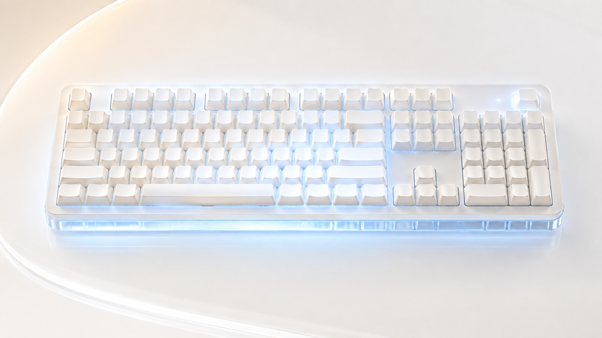

# Keyboard Logo Fix for macOS

[简体中文](README.md) · **English**



macOS writes a green indicator state to some HID keyboards, overriding the LOGO
lighting effect you configured and saved on the keyboard itself. Keyboard Logo
Fix clears that override so your own effect comes back. It never chooses a
colour or an animation — the effect it restores is the one already stored in
your keyboard.

## Supported keyboards

- **SCC100** — verified on hardware
- **FMate98** — verified through user reports

Both expose the HID identifiers and output report protocol this tool speaks:

| Connection | VID:PID | Notes |
| --- | --- | --- |
| USB wired | `258A:010C` | |
| Bluetooth LE | `3554:FA07` | may appear as `T100 5.0` |

`T100` is the controller identification the device reports to macOS, not a
physical keyboard model. Other keyboards using the same VID/PID and report
protocol may also work, but need confirmation on real hardware. Devices with
different identifiers or protocols are not recognised.

## Install

Download the latest `Keyboard-Logo-Fix-<version>-macOS.zip` from the
[Releases](../../releases) page, then:

1. Unzip it and drag **Keyboard Logo Fix.app** into your Applications folder.
2. Open the app and choose a connection: automatic, USB, or Bluetooth.
3. If macOS blocks the first launch, go to **System Settings → Privacy &
   Security** and choose **Open Anyway**.
4. Allow the app under **System Settings → Privacy & Security → Input
   Monitoring**, then reopen it.

### Upgrading from 0.1.x

The first launch of a newer version stops and removes the old
`local.codex.t100-logo-white` background service, and keeps reading the
connection preference saved by the old version. The old
`T100 Logo 白色呼吸.app` is not deleted automatically — move it to the Trash
yourself.

## How it works

Opening the app installs a per-user LaunchAgent:

```text
~/Library/LaunchAgents/com.ikuyu.keyboard-logo-fix.plist
```

The background service starts at login and keeps running, but stays idle:
it only listens for compatible keyboards connecting and for the Mac waking.
It briefly sends the restore report when any of these happen:

- the background service starts,
- a compatible keyboard connects or reconnects,
- the Mac wakes from sleep.

Each trigger sends for about 3 seconds at 50 ms intervals — roughly 60 reports.
The repetition is what outlasts macOS writing the green indicator state again
while the device initialises. The report only clears the indicator override,
letting the keyboard fall back to the LOGO effect you saved on it.

The tool does not flash firmware, remap keys, log keystrokes, or use the
network.

Preferences and logs live at:

```text
~/Library/Application Support/KeyboardLogoFix/preferred-connection
~/Library/Logs/KeyboardLogoFix.log
```

## Command line

```sh
./keyboard-logo-fix            # install the service and pick a connection
./keyboard-logo-fix 10         # restore once for 10 seconds (range 1–300)
./keyboard-logo-fix --daemon   # run the background service in the foreground
./keyboard-logo-fix --uninstall # remove current and 0.1.x background services
./keyboard-logo-fix --help     # usage
```

Uninstalling the service leaves the app, the connection preference, and the
log in place.

## Build from source

Requires the Xcode Command Line Tools. The default build produces a universal
binary for Apple Silicon and Intel Macs:

```sh
make            # build ./keyboard-logo-fix
make app        # package dist/Keyboard Logo Fix.app
make clean
```

`com.ikuyu.keyboard-logo-fix.plist` is a manual LaunchAgent template for use
once the app lives in `/Applications`.

### Source layout

| File | Responsibility |
| --- | --- |
| `src/main.c` | argument parsing and entry points |
| `src/keyboard.c` | HID device matching and sending the unlock report |
| `src/daemon.c` | background service: run loop, device and wake callbacks |
| `src/service.c` | installing and removing the LaunchAgent |
| `src/settings.c` | reading and writing the connection preference |
| `src/ui.c` | the connection picker and result dialogs |
| `src/platform.c` | process spawning, path building, XML escaping |
| `src/app_config.h` | bundle identifiers and shared constants |

## Releases

GitHub Actions builds and verifies the app on every push and pull request;
artifacts are downloadable from the workflow run. Pushing a `v*` tag creates a
GitHub Release:

```sh
git tag v0.2.0
git push origin v0.2.0
```

## Known limitations

- Only USB `258A:010C` and BLE `3554:FA07` are matched.
- Other Bluetooth pairings and 2.4 GHz receivers are untested.
- The app is ad-hoc signed and not notarised by Apple, so other users must
  allow it manually on first launch.

## License

[MIT](LICENSE)
