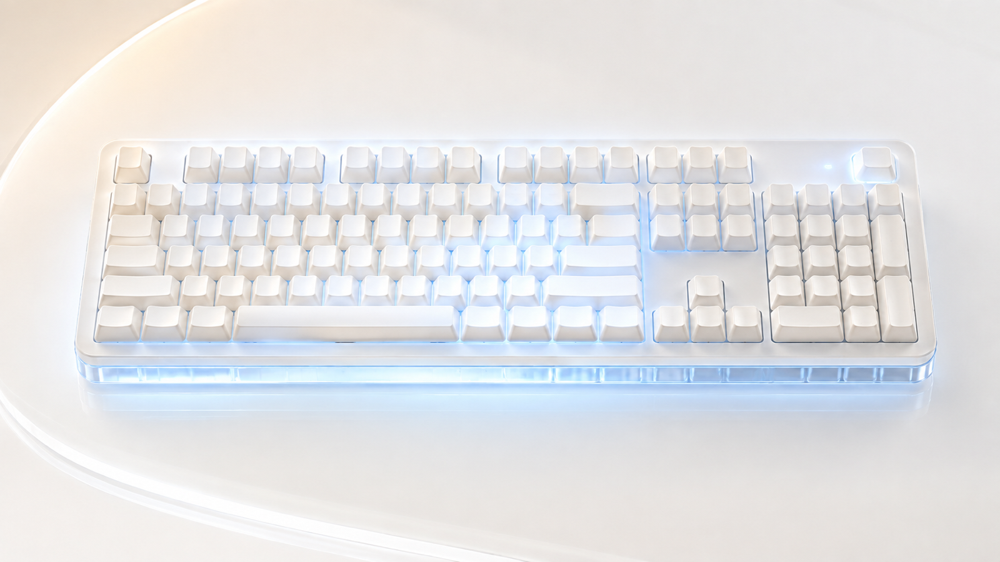

# Keyboard Logo Fix: get your keyboard's logo lighting back on macOS

[简体中文](README.md) · **English**



When some HID keyboards are plugged into a Mac, macOS writes a green indicator
state to them, which hides the LOGO lighting effect you saved on the keyboard.
Keyboard Logo Fix clears that override and nothing else. It doesn't set a
colour or an animation; you get back whatever effect is stored on the keyboard.

## Supported keyboards

- SCC100: tested on real hardware
- FMate98: confirmed working by a user

Both use the same HID identifiers and output report protocol:

| Connection | VID:PID | Notes |
| --- | --- | --- |
| USB wired | `258A:010C` | |
| Bluetooth LE | `3554:FA07` | may appear as `T100 5.0` |

`T100` is the name the keyboard's controller reports to macOS, not a keyboard
model. Other keyboards with the same VID/PID and report protocol will probably
work too, but I haven't tested any. Devices with different identifiers or
protocols aren't recognised.

## Install

Install with Homebrew:

```sh
brew install --cask hoobnn/tap/keyboard-logo-fix
```

Or download the latest `Keyboard-Logo-Fix-<version>-macOS.zip` from the
[Releases](../../releases) page, then:

1. Unzip it and drag **Keyboard Logo Fix.app** into your Applications folder
   (skip this step when installing with Homebrew).
2. Open the app and choose a connection: automatic, USB, or Bluetooth.
3. If macOS blocks the first launch, go to **System Settings → Privacy &
   Security** and choose **Open Anyway**.
4. Allow the app under **System Settings → Privacy & Security → Input
   Monitoring**, then reopen it.

### Upgrading from 0.1.x

The first launch of a newer version stops and removes the old
`local.codex.t100-logo-white` background service, and keeps reading the
connection preference saved by the old version. The old
`T100 Logo 白色呼吸.app` is not deleted automatically — move it to the Trash
yourself.

## How it works

Opening the app installs a per-user LaunchAgent:

```text
~/Library/LaunchAgents/com.ikuyu.keyboard-logo-fix.plist
```

The background service starts at login and sits idle, waiting for a compatible
keyboard to connect or the Mac to wake. It sends a short burst of restore
reports when:

- the background service starts,
- a compatible keyboard connects or reconnects,
- the Mac wakes from sleep.

Each burst sends one report every 50 ms for about 3 seconds, roughly 60 in
total. A single report isn't enough: macOS can write the green indicator state
again while the keyboard initialises. The report only clears the indicator
override, so the keyboard falls back to the effect you saved on it.

It doesn't flash firmware, remap keys, log keystrokes, or touch the network.

Preferences and logs live at:

```text
~/Library/Application Support/KeyboardLogoFix/preferred-connection
~/Library/Logs/KeyboardLogoFix.log
```

## Command line

```sh
./keyboard-logo-fix            # install the service and pick a connection
./keyboard-logo-fix 10         # restore once for 10 seconds (range 1–300)
./keyboard-logo-fix --daemon   # run the background service in the foreground
./keyboard-logo-fix --uninstall # remove current and 0.1.x background services
./keyboard-logo-fix --help     # usage
```

`--uninstall` only removes the background service. The app, the connection
preference and the log stay where they are.

## Build from source

Requires the Xcode Command Line Tools. The default build produces a universal
binary for Apple Silicon and Intel Macs:

```sh
make            # build ./keyboard-logo-fix
make test       # run the unit tests
make app        # package dist/Keyboard Logo Fix.app
make clean
```

`com.ikuyu.keyboard-logo-fix.plist` is a manual LaunchAgent template for use
once the app lives in `/Applications`.

### Source layout

| File | Responsibility |
| --- | --- |
| `src/main.c` | argument parsing and entry points |
| `src/keyboard.c` | HID device matching and sending the unlock report |
| `src/daemon.c` | background service: run loop, device and wake callbacks |
| `src/service.c` | installing and removing the LaunchAgent |
| `src/settings.c` | reading and writing the connection preference |
| `src/ui.c` | the connection picker and result dialogs |
| `src/platform.c` | process spawning, path building, XML escaping |
| `src/app_config.h` | bundle identifiers and shared constants |

## Releases

Pushes to main and pull requests run the unit tests and verify an unsigned
build (`.github/workflows/ci.yml`). Pushing a `v*` tag runs the same tests, then
signs, notarises and publishes a GitHub Release and updates the Homebrew cask
(`.github/workflows/release.yml`):

```sh
git tag v0.2.5
git push origin v0.2.5
```

Run the tests locally with `make test`. See [docs/RELEASE.md](docs/RELEASE.md)
for the full release steps.

## Known limitations

- Only USB `258A:010C` and BLE `3554:FA07` are matched.
- Other Bluetooth pairings and 2.4 GHz receivers are untested.
- Input Monitoring must be granted manually on first launch.

## License

[MIT](LICENSE)
